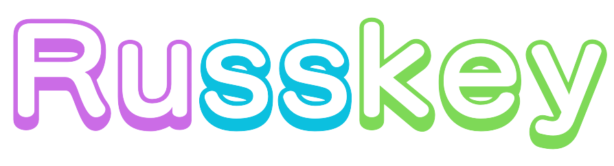

**🌎 [Russkey](https://misskey-hub.net/)**は、永遠に無料のオープンソースで分散型のソーシャルメディアプラットフォームです！ 🚀

---

---

## ✨ 特徴
- **ActivityPubサポート**\
- Russkeyを使っていない場合でも大丈夫です！Russkeyインスタンス同士だけでなく、MastodonやMisskey、Pixelfedなど他のネットワークのユーザーとも交流できます！
- **リアクション**\
任意の投稿に絵文字リアクションを追加できます！もういいねボタンに縛られることはありません。ボタンをタップして自分の気持ちをみんなに伝えましょう。
- **Drive**\
Russkeyの組み込みドライブでは、クラウドストレージをソーシャルメディア内で利用できます。ファイルをアップロードしたり、フォルダを作成したり、自分の投稿からメディアを見つけたりできます！
- **豊富なWeb UI**\
Russkeyには豊かで使いやすいWeb UIがあります！レイアウトの変更やウィジェットの追加、カスタムテーマの作成などが高度にカスタマイズできます。さらに、オリジナルのプログラミング言語であるAiScriptを使用してプラグインを作成できます。
- その他多くの機能...

## ドキュメンテーション

Misskeyのドキュメンテーションは[Misskey Hub](https://misskey-hub.net/)で入手できます。上記のリンクやグラフィックもそれぞれ該当する部分へリンクしています。

## スポンサー(Misskey)

	

## 謝辞

UI変更のレビューやビジュアルのリグレッションを確認するのに役立つ、ビジュアルテストプラットフォームを提供していただいた[Chromatic](https://www.chromatic.com/)に感謝します。

テストカバレッジを向上させるのに役立つ、コードカバレッジプラットフォームを提供していただいた[Codecov](https://about.codecov.io/for/open-source/)に感謝します。

多言語でRusskeyを翻訳するのに役立つ、ローカリゼーションプラットフォームを提供していただいた[Crowdin](https://crowdin.com/)に感謝します。

本番環境でRusskeyを実行するのに役立つ、コンテナプラットフォームを提供していただいた[Docker](https://hub.docker.com/)に感謝します。

